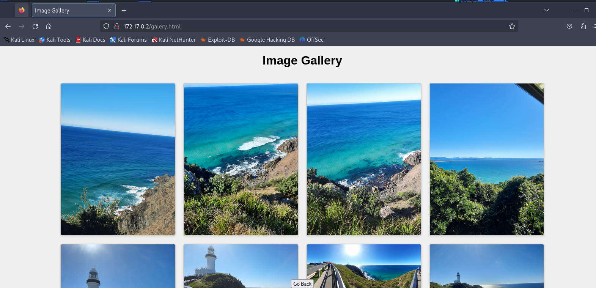

> **Write** **up** **–** **maquina** **Paradise**
>
> \- Primero empezamos analizando los puertos abiertos, para así
> descubrir los servicios que están corriendo en el servidor
>
> o Usando el siguiento comando de nmap descubrimos que tiene los
> siguentes puretos
>
> o ***nmap*** ***-sV*** ***-p-*** ***--open*** ***-T5***
> ***172.17.0.2*** ***-vv*** ***-Pn*** ***–n***

- Podemos ver que hay 4
puertos

> abiertos, así que vamos a analizar cada uno por separado para ver por
> donde podríamos atacar.

**PUERTO** **80**

Con nmap nos muestra que se trata de un apache2 en la última versión así
que vamos a visualizar la web en el navegador.

> PORT STATE SERVICE VERSION
>
> 80/tcp open http Apache httpd 2.4.58 ((Ubuntu)) \| http-methods:
>
> \|\_ Supported Methods: GET POST OPTIONS HEAD \|\_http-title: Andy's
> house
>
> \|\_http-server-header: Apache/2.4.58 (Ubuntu)

**En**
**en** **el** **navegador** vemos que nos muestra la siguiente web

**Vamos** **a** **ver** **las** **dos** **páginas** **que** **tiene**

Tenemos dos páginas las cuales una tiene como un formulario donde hay
que insertar un correo y en la otra página hay como una galería de
imágenes.

Insertamos un correo, y al parecer nos redirige a una página de error,
es PHP, lo cual podríamos pensar que se trataría de un LFI, pero para
esta máquina no hay ningún lfi.

>  style="width:3.61458in;height:2.03884in" />Ahora lo que podemos hacer
> es intentar de analizar en busca de directorios.

> \- Solo encontramos la carpeta img/ la cual solo contienen imagens,
> pero talvez alguna imagen pueda contener metadatos o esteganografía.
> Pero no es este el caso, asi que el siguiente paso será proceder a
> leer el código fuente.

Podemos ver que al final de la siguiente página galery.html encontramos
y encontramos una línea que parece estar cifrada en base64, así que
procederemos a descifrarla.

Al parecer vemos lo que podría ser una contraseña ya que vimos un
posible usuario Andy, y si vemos más arriba los puertos teníamos un
puerto 22 ssh y un el puerto de samba. Con lo cual podemos probar a ver
si accede por medio de ssh o smb con el usuario Andy y contraseña
estoesunsecreto. Aunque yo probaría a ver si se tratase de algún
directorio oculto el cual no se pueda descubrir usando gobuster o
cualquier otra herramienta de fuzzing.

Se trata de un directorio oculto, el cual contiene un fichero con un
título mensaje para lucas, supondremos que lucas será otro usuario, así
que se procede a descargar y leer el fichero

Y nos muestra el siguiente mensaje:

REMEMBER TO CHANGE YOUR PASSWORD ACCOUNT, BECAUSE YOUR PASSWORD IS DEBIL
AND THE HACKERS CAN FIND USING B.F.

El cual es un recordatorio para que el usuario lucas, ya que es un
menaje para el cambie su contraseña ya que es una contraseña simple y se
puede hacer B.F el cual supondremos que sera fuerza bruta.

Así que el siguiente paso
será hacer fuerza bruta sobre el usuario lucas para ver si conseguimos
acceder vía ssh al servidor.

Nuestro usuario seria lucas y la contraseña chocolate, mediante ssh

\- Ahora accederemos mediante ssh a la maquina y probaremos con sudo –l
para ver si podemos escalar.

Podemos ver que podemos ejecutar el binario sed mediante el usuario Andy
sin necesidad de poner contraseña y esto lo haremos gracias a la
siguiente sentencia que encontraremos en la pagina de gtfobins

> sudo -u andy sed -n '1e exec bash 1\>&0' /etc/hosts

Y esto nos sacara una shell en bash como el usuario andy

Y ahora comprobaremos cual es la siguente forma para obtener acceso como
root

Con sudo -l no podemos ya que no tenemos el password de andy así que
podemos prober con find

Y vemos que hay como un fichero llamado privileged_exec así que vamos a
investigarlo ya que tiene permisos suid

Y nos lo ejecutaremos
