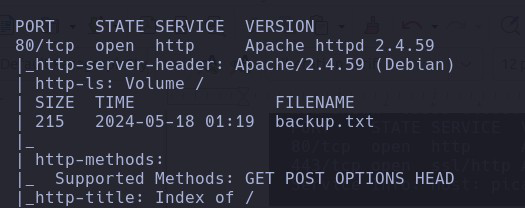
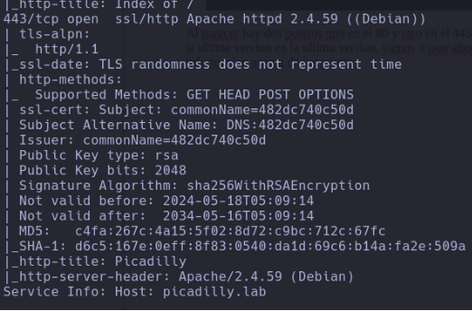
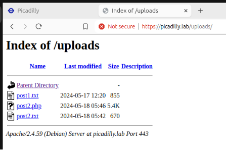
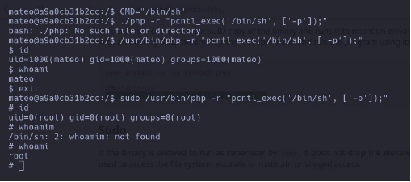

**Write up – maquina picadilly**

\- primero escaneamos los puertos que tiene la maquina y asi idetificar los servicios que tiene.

Al parecer hay dos puertos uno en el 80 y otro en el 443 con sistemas operativo Debian y apache en la ultima version en la ultima version, vamos a usar ahora el parametro -sCV para algo mas de informacion acerca de los puertos

**Puerto 80**

En el puerto 80 vemos que nos muestra que hay un index con un fichero llamado backup.txt asi que vamos ver el fichero 

como podemos ver nos dice que hay el password para el usuario mateo  hdvbfuadcb pero parece estar en encryptado ya que si leemos la frase de abajo nos dice que se trata de un antiguo emperador romano asi que un emperador romano con un tipo de cifrado es el Cesar asi que con d-code.fr podemos descifrarlo y guarnos el password para un futuro uso.

Y vemos que el password de mateo es easycrazy. **Puerto 443**

aqui podemos ver que hay una pagina web que responde a servername picadilly.lab y tiene ssl asi que vamos al navegador en usando [https://picadilly.lab](https://picadilly.lab/) peor antes iremos al fichero /etc/hosts y pondremos la ip del contendor seguido de picadilly.lab.

Vemos que hay un simple blog el cual vemos que mas abajo hay una opcion para subir ficheros y viendo el titulo del post vemos que permit subir archivos .txt. Pero vamos a probar a subir uno .php para ver si nos lo accepta.

Al parecer publica un post cuando subes un fichero

vamos a probar de subir un fichero con una reverse shell que descargaremos del github de pentestmonkey.

\

ahora iremos al direcctorio uploads ya que es ahi donde estan los posts almacenados

ahora nos abriremos con netcat en el puerto 4444 o el que especifiquemos en el fichero de la shell php

y ahora vamos a como con www-data no encontraremos nada vamos a iniciar session con mateo usando la contrasena que encontramos antes y con sudo -l compramos a ver si puede tiene permisos para ejecutar algun binario con permisos de root.

Podemos ver que el binario php se puede ejecutar con privilegos de root asi que lo buscaremos en gfobins para ver cual es el comando exacto para escalar privilegios.

Asdfd

seguimos los pasos de gfobins
## SUID
If the binary has the SUID bit set, it does not drop the elevated privileges and may be abused to access the file system, escalate or maintain privileged access as a SUID backdoor. If it is used to run sh -p, omit the - p argument  on  systems  like  Debian  (<=  Stretch)  that  allow  the default sh shell to run with SUID privileges.

This example creates a local SUID copy of the binary and runs it to maintain elevated privileges. To interact with an existing SUID binary skip the first command and run the program using its original path.

￿sudo install -m =xs $(which php) .

CMD="/bin/sh"

./php -r "pcntl\_exec('/bin/sh', ['-p']);"

y nos devolver una session como root.

